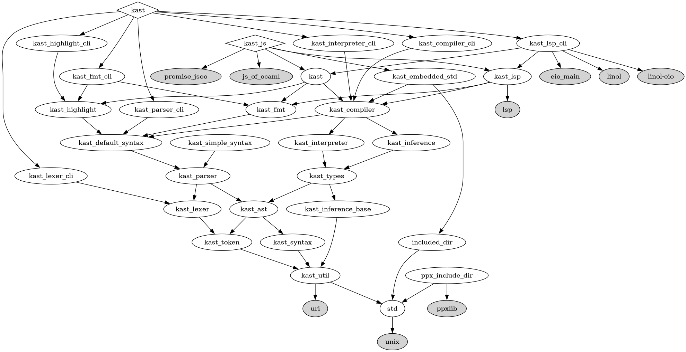

# Kast

An experimental programming language

This is a rewrite #3. You can find previous versions in

1. [`old-ocaml-version`](https://github.com/kast-lang/kast/tree/old-ocaml-version) branch
2. [`old-rust-version`](https://github.com/kast-lang/kast/tree/old-rust-version) branch
3. current version

**NOT READY YET**

[See more on the website](https://kast-lang.org)

